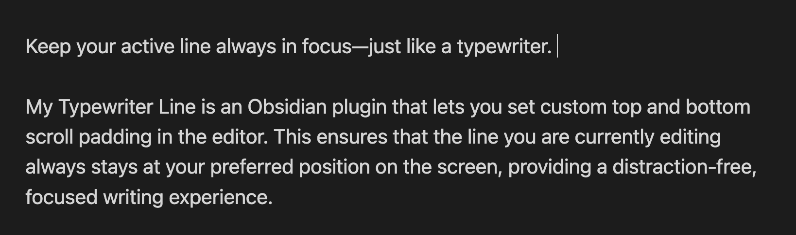
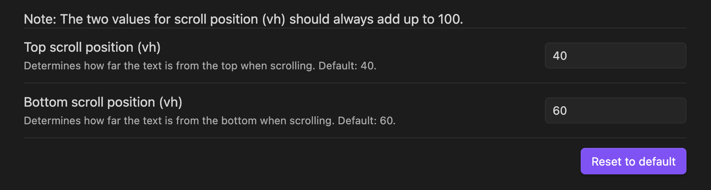

# My Typewriter Line

My Typewriter Line is an Obsidian plugin that lets you set custom top and bottom scroll padding in the editor, so your active line always stays in focus—just like a typewriter. Perfect for distraction-free, focused writing.

## Features

- Set custom top and bottom scroll padding (in vh)
- Keeps your cursor/active line centered or at your preferred position while typing
- Simple, distraction-free writing experience

---

## Installation

### From Obsidian Community Plugins

1. Open Obsidian and go to **Settings → Community plugins**.
2. Click on **Browse** and search for `My Typewriter Line`.
3. Click **Install** and then **Enable**.

### Manual Installation

1. Download the latest `main.js`, `manifest.json`, and `styles.css` from the Releases page.
2. Place these files in a new folder named `my-typewriter-line` inside your vault's `.obsidian/plugins/` directory.
3. Restart Obsidian and enable the plugin in **Settings → Community plugins**.

---

## Usage

1. Go to **Settings → My Typewriter Line**.
2. Adjust the **Top scroll position (vh)** and **Bottom scroll position (vh)** to your liking. The sum must always be 100.
3. Your active line will now stay at your preferred vertical position while you type.

---

## Example

---

## Setup

---

## Support & Feedback

- For issues or feature requests, open an issue on [GitHub](https://github.com/dmo-code/myWriteLine/issues).

---

## Developer Build Instructions

If you want to build the plugin yourself:

1. Make sure you have [Node.js](https://nodejs.org/) installed.
2. Clone this repository.
3. Run `npm install` to install dependencies.
4. Run `npm run build` to generate files in the `dist` folder.  
   The `manifest.json` and `styles.css` will be copied automatically to `dist/`.
5. Copy `main.js`, `manifest.json`, and `styles.css` from `dist/` to your Obsidian plugins folder (`.obsidian/plugins/my-typewriter-line`).

---

## License

MIT
